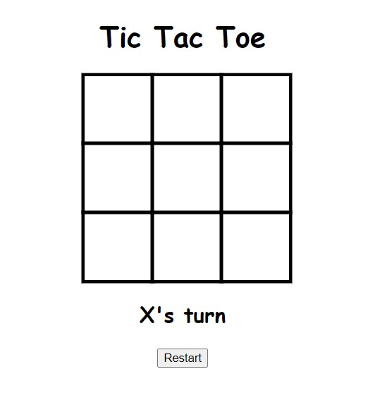
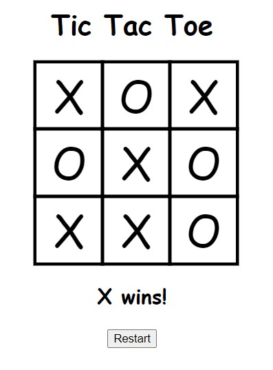

# TICTACTOE app





Simple game of TicTacToe !

**Deployed website**: https://tonylehuynh-tictactoejs.netlify.app/


### **Code explanation**

**CSS & HTML** 

9 Div elements were created to represent each of the cells for TicTacToe

```css
#cellContainer{
    display: grid;
    grid-template-columns: repeat(3, auto);
    width: 225px;
    margin: auto;
}
```
Display: grid along with grid-template-columns: repeat() were used to achieve the 3x3 grids. 

Each cell div element would also have it's own unique cellIndex id to uniquely identify it:

```html
<div cellIndex="0" class="cell"></div>
```


**JavaScript**

A winConditions array was established. This array contained all the combinations of cell indeces needed to win TicTacToe. For example, if the entire top row was filled out then the indeces representing the win would be [0, 1, 2]. A win where the cells were filled diagaonally from top left to bottom right would be represented by the indeces [0, 4, 8].

```js
const winConditions = [
    [0, 1, 2],
    [3, 4, 5],
    [6, 7, 8],
    [0, 3, 6],
    [1, 4, 7],
    [2, 5, 8],
    [0, 4, 8],
    [2, 4, 6]
];
```

At the start of the game, the player would start with "X". An empty options array would also be established. This array would store values based on what cellIndex was clicked on by the player. 

```js
let currentPlayer = "X";
let options = ["", "", "", "", "", "", "", "", ""];
```

For example, if player X clicked the top 3 cells, then the options array would be:

```js
options = ["X", "X", "X", "", "", "", "", "", ""];
```

The forEach method was used to add the "click" .addEventListener method on every cell in the the entire class, and invoke the cellClicked() function. 

```js
cells.forEach(cell => cell.addEventListener("click", cellClicked));
```

The cellClicked would retrieve the index of the cell div element that was clicked on by the user, through the .getAttribute method.

```js
const cellIndex = this.getAttribute("cellIndex");
```

The updateCell function would then be invoked. The empty options array would be updated to store the current player's value, whether "X" or "O", at the specific index of the div cell element that the player selected. The div cell's text content would also be updated to display either "X" or "O". 

```js
function updateCell(cell, index){
    options[index] = currentPlayer;
    cell.textContent = currentPlayer;
}
```


In the checkWinner() function, a for loop was used to iterate over the winConditions array. The winConditions array stores an array of winning index combinations. For example one winning combination is [3, 4, 5]. This particular array would then be stored in a local variable condition.

```js
for(let i = 0; i < winConditions.length; i++){
        const condition = winConditions[i];
```

Then, three variables were created to store values retrieved from the options array. As mentioned previously, the options array would either store "X", "O" or "", based on what was selected by the user.

From the array retrieved from the winCondition array, the winning indexes would be retrieved. For example, [3, 4, 5]. The indexes of the options array at [3, 4, 5] would also be retrieved and stored.

```js
const cellA = options[condition[0]];
const cellB = options[condition[1]];
const cellC = options[condition[2]];
```

```js
if(cellA == "" || cellB == "" || cellC == ""){
            continue;
        }
if(cellA == cellB && cellB == cellC){
	roundWon = true;
	break;
}
```

If any of the cells (retrieved from the options array) were empty, then the loop would continue. However, if the cells were all equal to each other, e.g. three "X"s, at the particular winning combinations - then this would mean a player had one.

E.g. a winning combination would be indexes [3, 4, 5]
The string values retrieved from the options array at indexes  [3, 4, 5] were ["X", "X", "X"]. This means player "X" won.


Finally, a changePlayer function was made. If the current player was "X", then the current player would be changed to "O" once a cell was clicked. This would also happened vice versa. This was achieved through use of the ternary operator

```js
function changePlayer(){
    currentPlayer = (currentPlayer == "X") ? "O" : "X";
```